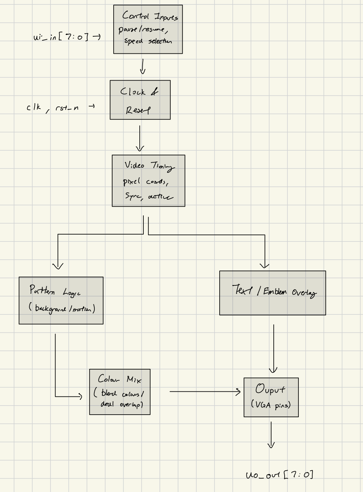

# TinyTapeout Project Proposal

## Project Overview

**Project Name:** WatPixels
**Team Members:** Tolga Selcuk and Joshua Zhang
**Date:** Sept 24, 2025

### Project Description

We are developing a demoscene project that generates visually engaging, overlapping patterns. The display will evolve over time and in a final scene featuring "Waterloo Engineering" and the uWaterloo emblem.

### Clock Requirements

The project requires a **25.2 MHz pixel clock** to drive a 640×480 VGA display at 60Hz:

- **Display Resolution**: 640×480 pixels
- **Refresh Rate**: 60 Hz  
- **VGA Timing**: 800×525 total pixels (640 visible + 160 horizontal blanking, 480 visible + 45 vertical blanking)
- **Pixel Clock**: 25.2 MHz (800 × 525 × 60 = 25,200,000 Hz)

This clock frequency ensures proper VGA synchronization and smooth 60Hz refresh rate for the visual patterns.

---

## 1. System Architecture

### System Components

**1. Control Inputs (ui_in[7:0])**
- Handles user interactions: pause/resume and speed selection
- 6 speed settings for pattern animation control

**2. Clock & Reset**
- 25.2 MHz pixel clock input
- Provides fundamental timing for entire pipeline

**3. Video Timing Generator**
- Generates pixel coordinates for 640×480 display
- Creates horizontal and vertical sync signals
- Produces active display signal (visible vs. blanking periods)
- Ensures VGA compliance and proper timing

**4. Pattern Logic (Background/Motion)**
- Generates dynamic visual patterns (spirals, waves, fractals)
- Creates time-based animations and pattern evolution
- Handles background layer of the demoscene

**5. Text/Emblem Overlay**
- Renders "Waterloo Engineering" text
- Displays uWaterloo emblem graphics
- Provides foreground overlay elements

**6. Colour Mix**
- Determines logic when one pixel has both foreground and background elements
- Handles color mixing and transparency effects

**7. VGA Output (uo_out[7:0])**
- Final RGB color data (6 bits: 2 per channel)
- Horizontal and vertical sync signals
- Drives physical VGA display pins

---

## 2. TT I/O Assignments

### Input Pins (8 total)

| Pin | Signal Name | Description                                      |
| --- | ----------- | ------------------------------------------------ |
| 0   | pause       | Pauses the operation or output of the core logic |
| 1   | resume      | Resumes operation after a pause                  |
| 2   | speed_1     | Selects speed setting 1 (lowest speed)           |
| 3   | speed_2     | Selects speed setting 2                          |
| 4   | speed_3     | Selects speed setting 3                          |
| 5   | speed_4     | Selects speed setting 4                          |
| 6   | speed_5     | Selects speed setting 5                          |
| 7   | speed_6     | Selects speed setting 6 (highest speed)          |

### Output Pins (8 total)

| Pin | Signal Name | Description                   |
| --- | ----------- | ----------------------------- |
| 0   | hsync       | VGA horizontal sync           |
| 1   | B[0]        | Blue (LSB)                    |
| 2   | G[0]        | Green (LSB)                   |
| 3   | R[0]        | Red (LSB)                     |
| 4   | vsync       | VGA vertical sync             |
| 5   | B[1]        | Blue (MSB)                    |
| 6   | G[1]        | Green (MSB)                   |
| 7   | R[1]        | Red (MSB)                     |

### Bidirectional Pins (8 total)

Unused

---

## 3. Projected Work Schedule

### Phase 1: Design & Planning (Week 1-2)

- [ ] Complete detailed design specification
- [ ] Finalize block diagram and I/O assignments

### Phase 2: Implementation (Week 3-7)

- [ ] **Pattern Generation Engine**
  - Implement mathematical pattern generators (spirals, waves, fractals)
  - Create pattern blending and mixing algorithms
  - Develop time-based pattern evolution logic
- [ ] **Animation System**
  - Implement frame counter and timing control
  - Create smooth transitions between pattern phases
  - Develop speed control based on input pins
- [ ] **Text Rendering Engine**
  - Implement character bitmap storage and lookup
  - Create text positioning and rendering logic
  - Develop "Waterloo Engineering" and emblem display
- [ ] **State Machine Controller**
  - Implement pause/resume functionality
  - Create scene transition logic
  - Develop overall system coordination

### Phase 3: Final Integration (Week 8)

- [ ] Final system integration
- [ ] Performance optimization
- [ ] Documentation completion
- [ ] Final testing and validation

### Deliverables and Success Criteria

**Deliverables:**
- Complete Verilog source code with testbenches
- Working VGA demonstration on Tiny Tapeout test board
- Project documentation

**Success Criteria:**
- Generates visual patterns on 640×480 VGA display at 60Hz
- All input controls (pause/resume/speed) function correctly
- Meets Tiny Tapeout submission requirements

---

## 4. Risks and Challenges

### Technical Risks
- **Timing Closure**: Meeting 25.2 MHz timing requirements in limited area
- **Memory Constraints**: Fitting all pattern data within available resources
- **VGA Compliance**: Ensuring proper sync signal generation and timing
- **Power Consumption**: Staying within Tiny Tapeout power limits

### Mitigation Strategies
- Early timing analysis and critical path optimization
- Algorithmic pattern generation to reduce memory requirements
- Extensive simulation testing before tapeout
- Conservative design margins for timing and power

### Contingency Plans
- Reduced pattern complexity or overlay complexity if resource constraints are exceeded
- Alternative VGA resolutions (320×240) if timing cannot be met